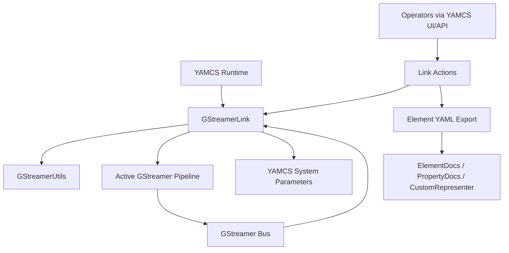
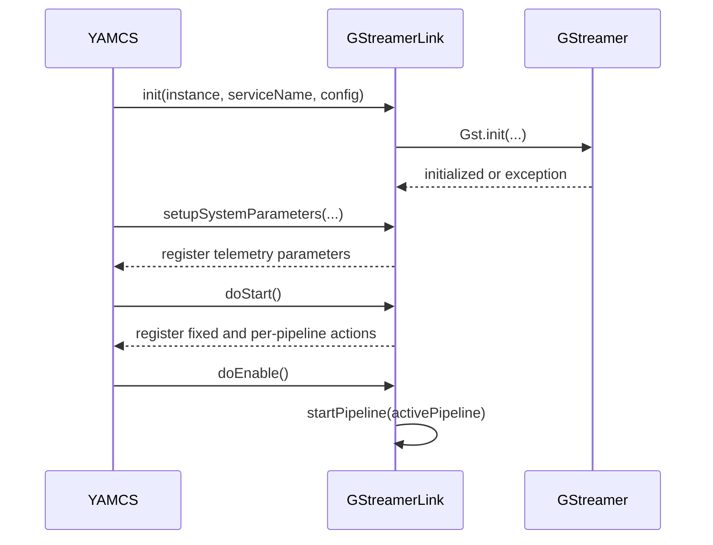
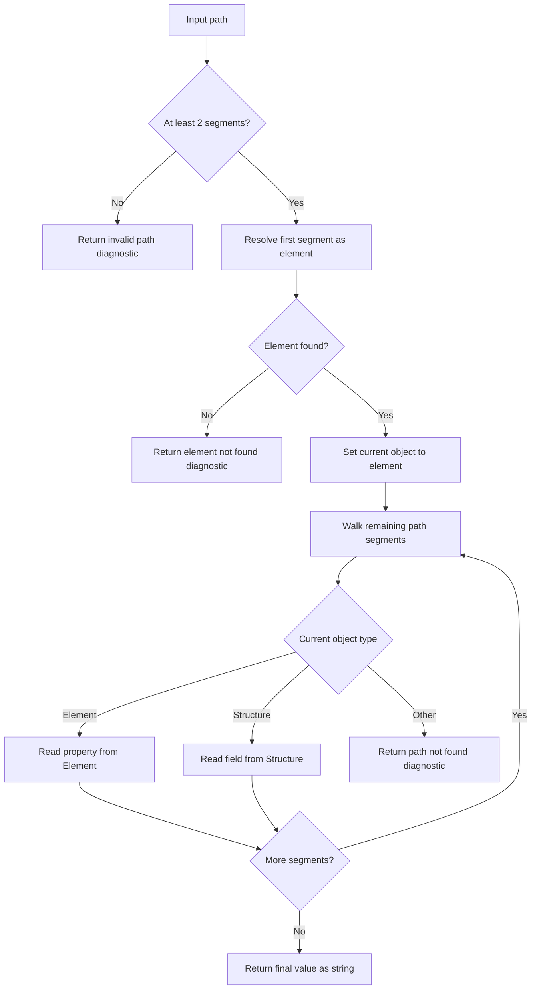
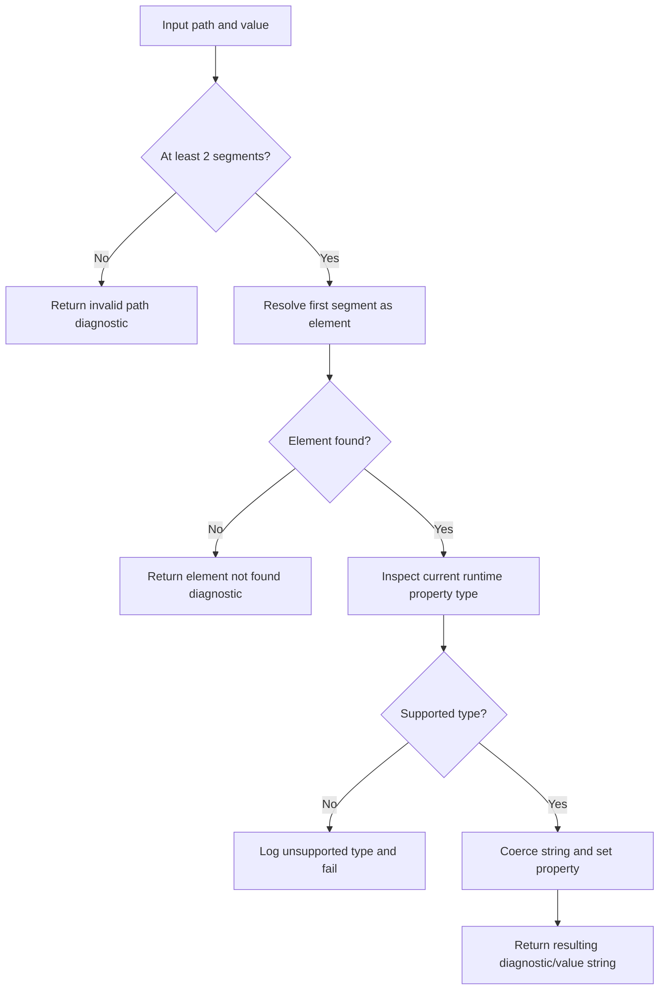
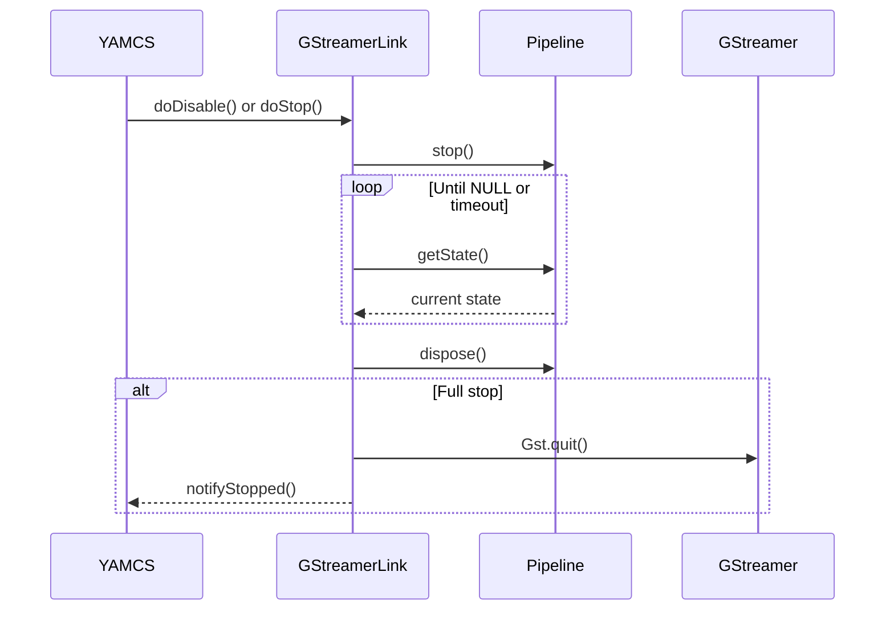

# Design

## Purpose

This document captures the current design of `yamcs-gstreamer` as implemented in the repository today. It is intended for:

- Software developers maintaining or extending the plugin
- Agentic LLMs performing maintenance, debugging, or feature work

This document complements [REQUIREMENTS.md](/home/mbenson/git/yamcs-gstreamer/REQUIREMENTS.md:1):

- `REQUIREMENTS.md` defines the externally visible contract
- `DESIGN.md` explains how the current code satisfies that contract

If implementation changes invalidate this document, update both documents together.

## System Context

`yamcs-gstreamer` is a YAMCS datalink plugin implemented as a Java Maven project. Its job is to let a YAMCS link instance own one live GStreamer pipeline, expose selected pipeline properties as YAMCS system parameters, and provide operator actions for inspection and runtime control.

Primary runtime technologies:

- YAMCS link lifecycle and action framework
- GStreamer Java bindings (`gst1-java-core`)
- JNA for native binding support
- SnakeYAML for YAML export used by the element-documentation action

Primary source files:

- [src/main/java/com/windhoverlabs/yamcs/media/GStreamerLink.java](/home/mbenson/git/yamcs-gstreamer/src/main/java/com/windhoverlabs/yamcs/media/GStreamerLink.java:1)
- [src/main/java/com/windhoverlabs/yamcs/media/utils/GStreamerUtils.java](/home/mbenson/git/yamcs-gstreamer/src/main/java/com/windhoverlabs/yamcs/media/utils/GStreamerUtils.java:1)
- [src/main/java/com/windhoverlabs/yamcs/media/actions](/home/mbenson/git/yamcs-gstreamer/src/main/java/com/windhoverlabs/yamcs/media/actions)
- [src/main/java/com/windhoverlabs/yamcs/media/model](/home/mbenson/git/yamcs-gstreamer/src/main/java/com/windhoverlabs/yamcs/media/model)
- [pom.xml](/home/mbenson/git/yamcs-gstreamer/pom.xml:1)

## Architectural Overview

The design is centered on a single coordinating class, `GStreamerLink`, with three supporting layers:

1. Link lifecycle and orchestration
   `GStreamerLink` owns configuration, the active `Pipeline`, action registration, status reporting, telemetry registration, and telemetry sampling.

2. Property path utilities
   `GStreamerUtils` implements the path-based read and write helpers used by telemetry collection and several actions.

3. Operator-facing actions and YAML export support
   `actions/*` adapt YAMCS actions to the link and utilities. `model/*` and `CustomRepresenter` support export of discovered element metadata to YAML.

The architecture is intentionally small and direct. There is no separate service layer, persistence layer, or asynchronous command queue. Most operations are synchronous and are executed directly in the link or action methods.



## Design Goals Preserved By The Current Implementation

- Keep one clear owner for the live pipeline per link instance
- Expose a minimal YAMCS-compatible control surface
- Prefer operational resilience and diagnostics over strict exception-heavy behavior
- Make runtime introspection available without external tooling
- Keep deployment simple by packaging the required Java-side GStreamer dependencies into the plugin artifact

Requirement trace:

- SR-001, SR-002
- CR-001 through CR-005
- LR-001 through LR-007
- PR-001 through PR-006
- TR-001 through TR-005
- AR-001 through AR-007
- BR-001 through BR-003

## Component Model

### 1. `GStreamerLink`

File:
- [GStreamerLink.java](/home/mbenson/git/yamcs-gstreamer/src/main/java/com/windhoverlabs/yamcs/media/GStreamerLink.java:77)

Responsibilities:

- Define the YAMCS configuration schema in `getSpec()`
- Initialize GStreamer during link initialization
- Hold the selected pipeline name and the live `Pipeline` instance
- Register system parameters for configured telemetry paths
- Sample telemetry values from the active pipeline
- Register and expose operator actions
- Start, stop, enable, and disable the active pipeline
- Map pipeline runtime state to YAMCS link status
- Subscribe to the GStreamer bus and log operational messages

State owned by the class:

- `telemetryParameters`: registered YAMCS parameter definitions
- `pipeline`: the currently instantiated GStreamer pipeline, or `null`
- `activePipeline`: selected pipeline name, even when no runtime pipeline is currently instantiated

Key design choice:

- One link instance owns at most one runtime `Pipeline`. This simplifies lifecycle, status mapping, and telemetry behavior, and directly supports CR-005 and PR-002.

Requirement trace:

- CR-001 through CR-005
- LR-001 through LR-007
- PR-001 through PR-006
- TR-001 through TR-005
- DR-001

### 2. `GStreamerUtils`

File:
- [GStreamerUtils.java](/home/mbenson/git/yamcs-gstreamer/src/main/java/com/windhoverlabs/yamcs/media/utils/GStreamerUtils.java:48)

Responsibilities:

- Serialize a live GStreamer element into a readable property dump
- Resolve a slash-delimited property path against a pipeline
- Write a string value into a direct element property using runtime type coercion

Key design choice:

- Reads and writes are path-based and string-driven. This keeps the operator interface simple and allows telemetry configuration to use a compact uniform syntax.

Constraint:

- Reads support nested traversal into `Structure` instances.
- Writes are only reliably designed for direct element properties. Nested writes are not a guaranteed feature.

Requirement trace:

- TP-001 through TP-006
- TR-003, TR-004
- DR-002

### 3. Action Classes

Files:

- [DumpAllElementNamesToLog.java](/home/mbenson/git/yamcs-gstreamer/src/main/java/com/windhoverlabs/yamcs/media/actions/DumpAllElementNamesToLog.java:1)
- [DumpElementToLog.java](/home/mbenson/git/yamcs-gstreamer/src/main/java/com/windhoverlabs/yamcs/media/actions/DumpElementToLog.java:1)
- [DumpPropertyToLog.java](/home/mbenson/git/yamcs-gstreamer/src/main/java/com/windhoverlabs/yamcs/media/actions/DumpPropertyToLog.java:1)
- [WritePropertyByPath.java](/home/mbenson/git/yamcs-gstreamer/src/main/java/com/windhoverlabs/yamcs/media/actions/WritePropertyByPath.java:1)
- [SetActivePipelineAction.java](/home/mbenson/git/yamcs-gstreamer/src/main/java/com/windhoverlabs/yamcs/media/actions/SetActivePipelineAction.java:1)
- [DumpAllElementsToFile.java](/home/mbenson/git/yamcs-gstreamer/src/main/java/com/windhoverlabs/yamcs/media/actions/DumpAllElementsToFile.java:1)

Responsibilities:

- Translate YAMCS action invocations into link or utility operations
- Validate required action parameters through YAMCS `Spec`
- Provide operator-visible diagnostics via logging and action completion behavior

Key design choice:

- Actions are thin adapters. They do not own pipeline state and should remain thin unless a future feature clearly requires richer orchestration.

Requirement trace:

- AR-001 through AR-007
- DR-002

### 4. YAML Export Support

Files:

- [ElementDocs.java](/home/mbenson/git/yamcs-gstreamer/src/main/java/com/windhoverlabs/yamcs/media/model/ElementDocs.java:1)
- [PropertyDocs.java](/home/mbenson/git/yamcs-gstreamer/src/main/java/com/windhoverlabs/yamcs/media/model/PropertyDocs.java:1)
- [CustomRepresenter.java](/home/mbenson/git/yamcs-gstreamer/src/main/java/com/windhoverlabs/yamcs/media/utils/CustomRepresenter.java:1)

Responsibilities:

- Represent GStreamer element metadata as serializable Java objects
- Emit YAML while omitting null fields
- Emit bean properties with `name` first for readability and stable output shape

Key design choice:

- Export uses lightweight DTO-style models rather than exposing raw GStreamer objects to SnakeYAML.

Requirement trace:

- YR-001 through YR-005

### 5. Build And Packaging

File:
- [pom.xml](/home/mbenson/git/yamcs-gstreamer/pom.xml:1)

Responsibilities:

- Build the Java project with Maven
- Declare YAMCS, GStreamer, JNA, and test dependencies
- Shade GStreamer Java runtime dependencies into the artifact
- Produce a YAMCS extension bundle

Key design choice:

- Runtime Java-side dependencies needed for GStreamer integration are bundled into the artifact to reduce deployment friction on the Java side.

Requirement trace:

- SR-001
- BR-001 through BR-003

## Runtime Data Model

### Configuration Data

Input configuration is supplied by YAMCS and includes:

- The link instance identity
- An optional initially selected pipeline name
- Zero or more named pipeline definitions
- Zero or more telemetry path definitions

Internally:

- Pipeline definitions remain in YAMCS configuration and are looked up by name when needed
- Telemetry definitions are converted into YAMCS `Parameter` registrations at startup

Requirement trace:

- CR-001 through CR-005
- TR-001

### Runtime Pipeline State

The runtime state is intentionally small:

- No pipeline instantiated
- One pipeline instantiated and transitioning or running

The design does not keep a cache of multiple prepared pipelines. Switching is done by stopping the current pipeline and constructing the new one from configuration.

Requirement trace:

- CR-005
- PR-002

## Control Flow

### Startup And Initialization Flow

1. YAMCS creates and initializes the link instance.
2. `GStreamerLink.init()` stores configuration and calls `Gst.init(...)`.
3. `setupSystemParameters()` registers one YAMCS system parameter per configured telemetry path.
4. `doStart()` registers generic actions and one per-pipeline activation action.
5. Link enablement triggers `doEnable()`, which starts the selected active pipeline when one is configured.

Why this shape:

- Initialization performs dependency setup early so failures surface as configuration problems.
- Telemetry registration is decoupled from pipeline creation so YAMCS knows about parameters even before a pipeline is active.



Requirement trace:

- LR-001 through LR-004
- TR-001
- AR-001, AR-002

### Pipeline Activation Flow

1. An operator or startup selection identifies a pipeline name.
2. `startPipeline(name)` stops the current pipeline if one exists.
3. The link looks up the configured pipeline definition by name.
4. The GStreamer parser constructs a new runtime `Pipeline` from the launch description.
5. The link installs a bus listener.
6. The link calls `play()`.

Why this shape:

- Name-based selection keeps UI and configuration aligned.
- Recreating the pipeline on activation avoids hidden mutable configuration state inside previously used pipeline instances.

```mermaid
flowchart TD
    S[Pipeline selected] --> C{Existing pipeline active?}
    C -- Yes --> STOP[stopPipeline()]
    C -- No --> LOOKUP[Lookup config by name]
    STOP --> LOOKUP
    LOOKUP --> FOUND{Definition found?}
    FOUND -- No --> ERR[Log diagnostic and return]
    FOUND -- Yes --> PARSE[Gst.parseLaunch(description)]
    PARSE --> BUS[Attach bus listener]
    BUS --> PLAY[pipeline.play()]
    PLAY --> RUN[Active pipeline running]
```

Requirement trace:

- PR-001 through PR-004
- AR-002

### Telemetry Sampling Flow

1. YAMCS requests current system parameters.
2. The link iterates the registered telemetry parameter definitions.
3. For each parameter, the link uses the parameter long description as the canonical telemetry path.
4. `GStreamerUtils.readPropertyByPath(...)` resolves the path against the active pipeline.
5. When a non-null result is returned, the value is published as a YAMCS string parameter value.

Why this shape:

- The `longDescription` field is used as a durable storage location for the original telemetry path.
- String publication avoids requiring per-property type mapping into YAMCS schema.

```mermaid
flowchart TD
    R[YAMCS requests system parameters] --> AP{Active pipeline?}
    AP -- No --> RET0[Return base link parameters only]
    AP -- Yes --> LOOP[Iterate registered telemetry parameters]
    LOOP --> PATH[Read canonical path from longDescription]
    PATH --> RESOLVE[GStreamerUtils.readPropertyByPath(...)]
    RESOLVE --> VAL{Non-null result?}
    VAL -- No --> NEXT[Skip update]
    VAL -- Yes --> PUB[Publish STRING parameter value]
    PUB --> NEXT
    NEXT --> MORE{More telemetry?}
    MORE -- Yes --> PATH
    MORE -- No --> RET1[Return collected parameter values]
```

Requirement trace:

- TR-001 through TR-005
- TP-001 through TP-003

### Property Read Flow

1. Split the path on `/`.
2. Use the first segment as the element name.
3. Resolve the element from the active pipeline.
4. Traverse the remaining segments:
   direct property lookup while the current object is an `Element`
   structure field lookup while the current object is a `Structure`
5. Return the final value as a string, or a diagnostic string for failure cases.

Why this shape:

- It supports both simple properties and common nested structure reads without requiring a larger object model.



Requirement trace:

- TP-001 through TP-003

### Property Write Flow

1. Split the path on `/`.
2. Resolve the target element by the first path segment.
3. For the direct property segment, inspect the current runtime property type.
4. Coerce the input string into that type when supported.
5. Set the property value on the element.
6. Return a diagnostic or resulting value string for logging.

Why this shape:

- Runtime-type inspection avoids a separate static schema for writable properties.

Constraint:

- The current implementation is designed around direct element property writes, not guaranteed nested structure writes.



Requirement trace:

- TP-004 through TP-006
- AR-006

### Shutdown Flow

1. `doDisable()` or `doStop()` calls `stopPipeline()`.
2. The pipeline is asked to stop.
3. The link waits for the GStreamer state to reach `NULL`, with timeout protection.
4. The pipeline is disposed and the field is cleared.
5. On full stop, `Gst.quit()` is called and YAMCS is notified that the link has stopped.

Why this shape:

- The state wait avoids disposing a pipeline immediately after a stop request while it is still transitioning.



Requirement trace:

- LR-005 through LR-007

## Status And Diagnostics Design

### Link Status Mapping

The link maps GStreamer state into YAMCS link status with intentionally simple semantics:

- No runtime pipeline means the link is disabled from a media-processing perspective
- `PLAYING` means healthy
- `PAUSED` is treated as disabled
- `NULL` after instantiation is treated as failed
- Other states are treated as unavailable

This is not a full fidelity model of all GStreamer state nuances. It is a coarse operator-facing health mapping.

Requirement trace:

- PR-005, PR-006

### Bus Logging

The GStreamer bus callback is used for operational diagnostics. It logs:

- Errors
- Warnings
- Informational messages
- Tags
- Buffering messages
- Need-context requests
- Other messages at debug level

Why this shape:

- The plugin does not expose a richer message event API; logging is the primary diagnostic surface.

Requirement trace:

- DR-001

### Resilience Model

The design intentionally favors continued operation and diagnostics over strict failure in operator-facing inspection paths:

- Missing properties usually return diagnostic strings rather than throwing
- Unsupported writes log warnings or errors rather than crashing the link
- Introspection actions complete with diagnostics where practical

This keeps exploratory actions safe even when some GStreamer plugins behave inconsistently.

Requirement trace:

- TR-005
- TP-003, TP-006
- DR-002

## Action Design

### Action Registration Strategy

Action registration happens in `doStart()`. There are two categories:

- Fixed actions always present on every started link
- Dynamic activation actions generated from configured pipeline definitions

Why this shape:

- Generic introspection actions are always useful
- Pipeline-switch actions are configuration-driven and should match the operator-visible configured set

Requirement trace:

- AR-001, AR-002

### Thin Action Pattern

Each action follows the same pattern:

1. Define a YAMCS `Spec` if input is required
2. Pull required values from the action request
3. Fetch the active pipeline or invoke the link
4. Delegate the real operation
5. Complete the action result

This pattern keeps behavior centralized and makes later testing easier.

Requirement trace:

- AR-003 through AR-007
- QR-003

## YAML Export Design

The `DumpAllElementsToFile` action is an offline discovery and documentation tool built into the plugin.

Flow:

1. Ensure GStreamer is initialized
2. Enumerate all available `ElementFactory` instances
3. Create an element instance for each factory when possible
4. Extract metadata and properties into `ElementDocs` and `PropertyDocs`
5. Serialize the list to YAML using `CustomRepresenter`

Design rationale:

- The export is intentionally detached from the active runtime pipeline
- It documents the installed GStreamer environment, not just the currently running graph
- DTO objects create a stable serialization format independent of GStreamer internals

Requirement trace:

- AR-007
- YR-001 through YR-005

## Build And Deployment Design

The Maven build has two deployment-oriented concerns:

- Produce the plugin jar
- Produce a YAMCS extension bundle

The build also shades the Java-side GStreamer dependencies:

- `org.freedesktop.gstreamer:gst1-java-core`
- `net.java.dev.jna:jna`

This reduces the number of Java dependencies that must be separately installed in the YAMCS runtime, though native GStreamer availability is still an external runtime concern.

Requirement trace:

- BR-001 through BR-003

## Constraints And Non-Goals

The current design deliberately does not provide:

- More than one active pipeline per link instance
- Typed telemetry values beyond YAMCS string parameters
- Guaranteed nested-property write support
- A durable persistence model for runtime property changes
- A high-level abstraction over GStreamer graph semantics

These are not accidental omissions. They are part of the current simplification strategy and align with `REQUIREMENTS.md`.

Requirement trace:

- CR-005
- TP-004
- Out-of-scope items in [REQUIREMENTS.md](/home/mbenson/git/yamcs-gstreamer/REQUIREMENTS.md:280)

## Extension Points

Future work can be added most safely in these places:

- New link actions in `actions/*`
- Additional diagnostics in bus-message handling
- More explicit test seams around GStreamer parser and pipeline objects
- Typed telemetry mapping if requirements are updated first
- Richer YAML export fields if kept backward compatible or versioned

Before extending behavior, check whether the change affects:

- Action names
- Configuration schema
- Telemetry parameter naming
- Detailed status semantics
- Pipeline-switch behavior

If yes, update `REQUIREMENTS.md` first or alongside the code.

Requirement trace:

- QR-002, QR-003

## Maintenance Guidance For Humans And LLMs

When modifying this repository:

1. Treat `GStreamerLink` as the orchestration boundary.
2. Keep path parsing behavior centralized in `GStreamerUtils`.
3. Keep actions thin unless there is a clear reason to move orchestration logic.
4. Preserve externally visible names and paths unless requirements are intentionally changed.
5. Prefer adding test seams over embedding more static direct calls.
6. Preserve resilience in negative paths; do not convert routine operator failures into uncaught exceptions.

## Traceability Matrix

### Requirements To Design Elements

- SR-001, BR-001, BR-002, BR-003
  Satisfied by Maven build and packaging design in `pom.xml`

- SR-002, CR-001 through CR-005, LR-001 through LR-007, PR-001 through PR-006, TR-001 through TR-005, DR-001
  Satisfied primarily by `GStreamerLink`

- TP-001 through TP-006, DR-002
  Satisfied primarily by `GStreamerUtils`

- AR-001 through AR-007
  Satisfied by `GStreamerLink` action registration plus `actions/*`

- YR-001 through YR-005
  Satisfied by `DumpAllElementsToFile`, `ElementDocs`, `PropertyDocs`, and `CustomRepresenter`

- QR-002, QR-003
  Satisfied by current layering discipline and by preserving contract-first maintenance

## Known Design Weaknesses

These are current design characteristics, not necessarily defects:

- `GStreamerLink` mixes lifecycle, telemetry, status, and action registration responsibilities in one class.
- The implementation relies on direct static calls to GStreamer APIs, which makes fine-grained unit testing harder without additional seams.
- Telemetry values are all published as strings, which simplifies design but loses type information.
- Write support is narrower than read support.

These weaknesses should be addressed only with care, because they sit on the main control path and can easily break externally visible behavior.
